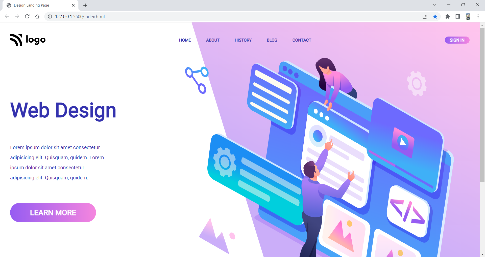

# Project 8: Web Design Landing Page

   

### Name:

> `Anshul Ghogre`

## Key Learnings from the project

- _Changed my value units from pixels to rem, felt it more comfortable._

---

### Screenshots:-

---

> Time taken to complete this project: 3hrs

---

## [Live-Link](https://project-8-web-design-landing-page.netlify.app/)

---
